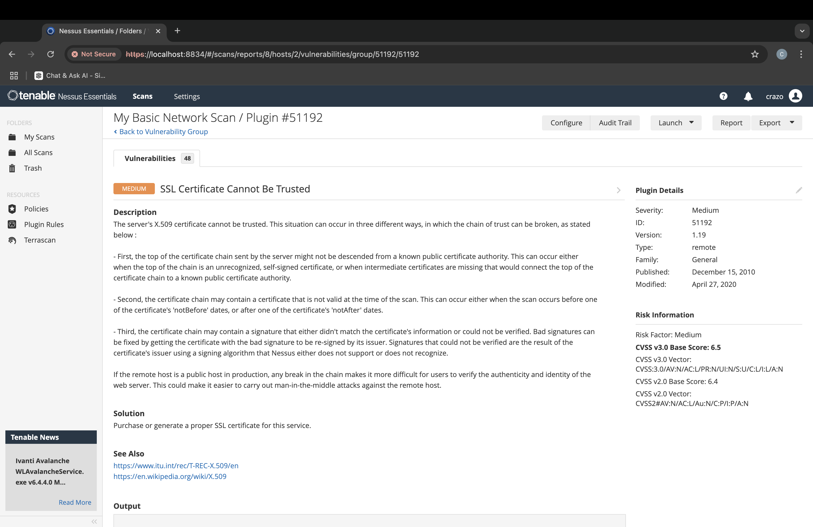
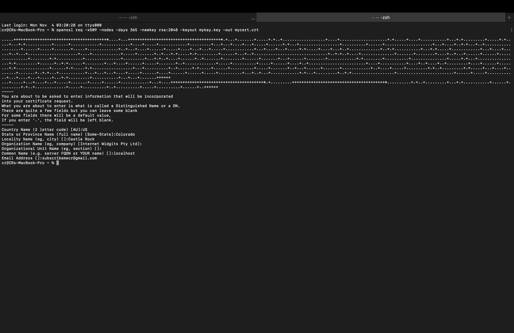
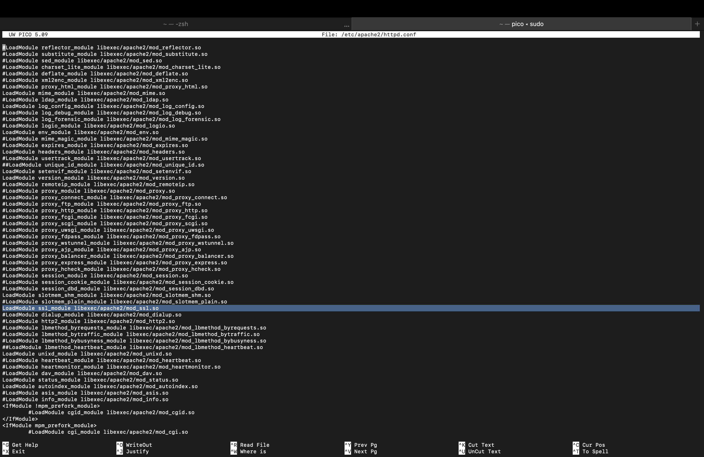
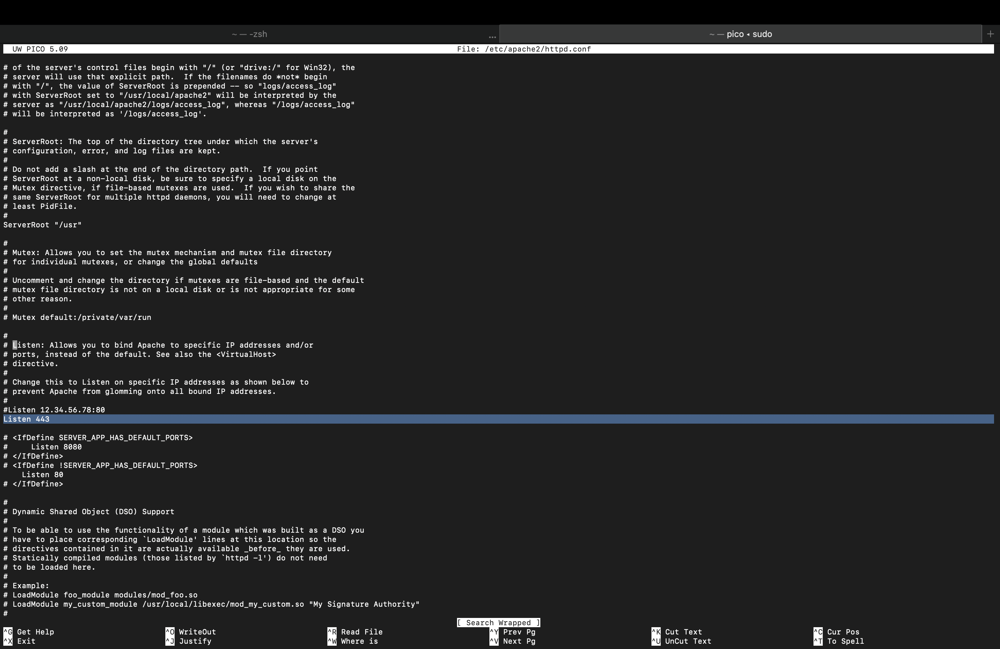
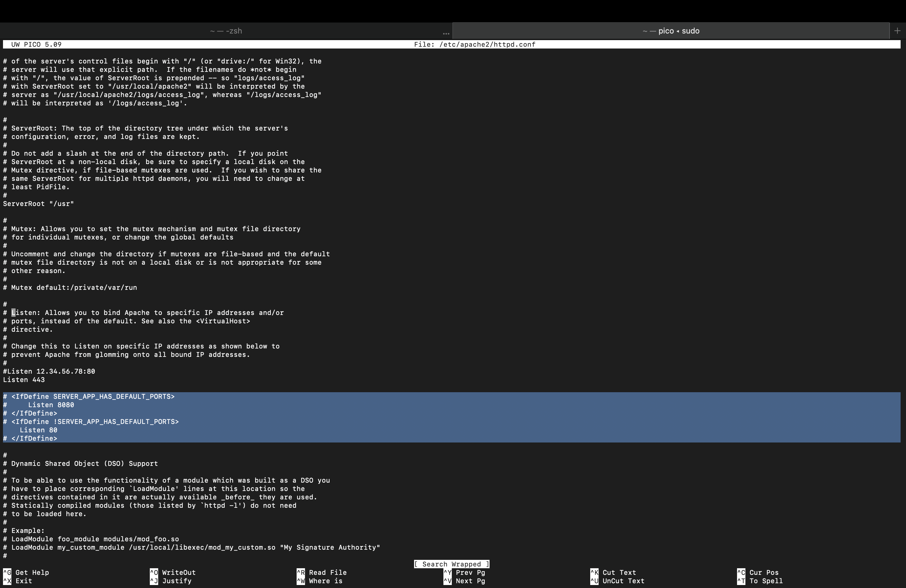
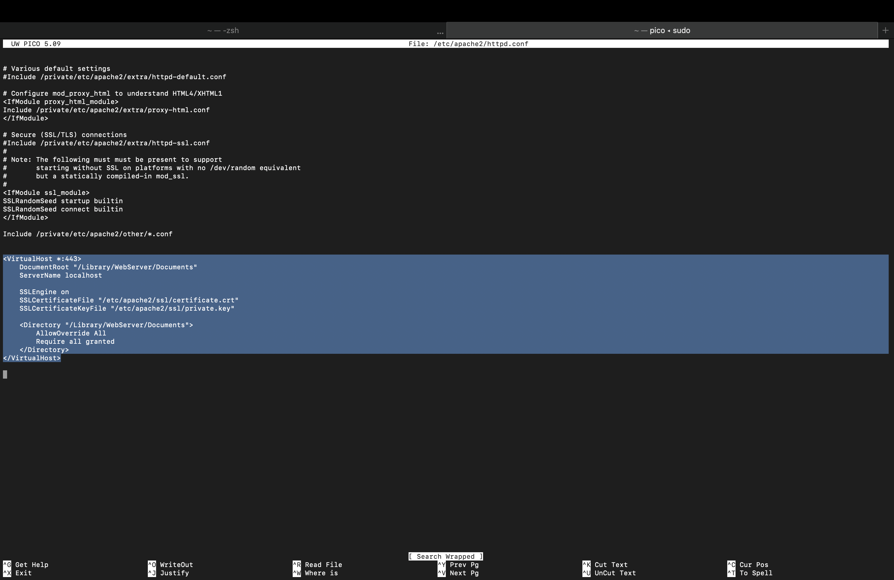

# SSL/TLS Configuration Project

**Project Overview**  
This project addresses an SSL certificate trust issue identified by a Nessus scan, leading to the setup of a self-signed SSL certificate on an Apache server.

**Steps Taken**:
1. **Generate Self-Signed Certificate**: Used OpenSSL to create a self-signed certificate.
2. **Configure Apache**: Modified Apache settings to use SSL and listen on port 443.
3. **Test the Setup**: Accessed `https://localhost` to verify HTTPS functionality.

**Screenshots**:
- **Nessus Scan Result**: 
- **OpenSSL Command**: 
- **Apache Configuration**:
  -  <!-- Replace with actual file name -->
  -  <!-- Replace with actual file name -->
  -  <!-- Replace with actual file name -->
  -  <!-- Replace with actual file name -->
- **Test Result**: 

**Outcome**: This configuration provides HTTPS encryption, although the self-signed certificate will show a browser warning.
